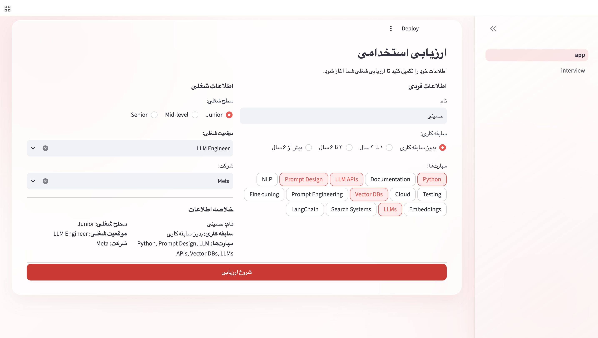
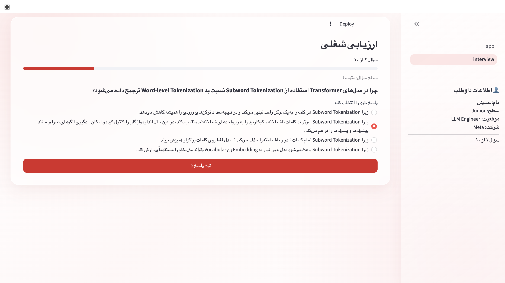
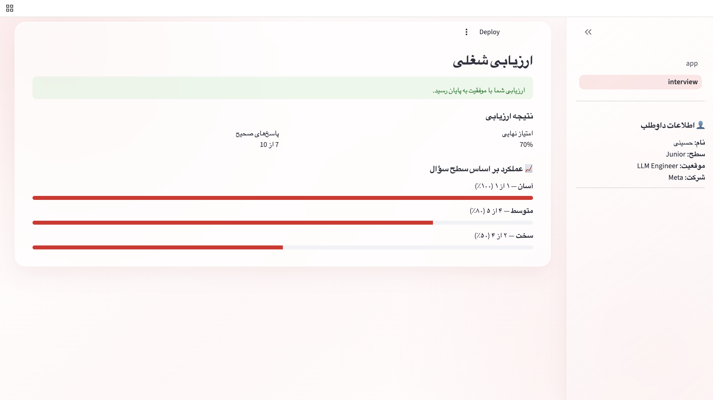

# Intelligent Interview Assistant

An **LLM-assisted adaptive technical interview system** designed to evaluate candidates based on their technical knowledge, background, target role, and previous interview performance.

The system uses **LangGraph** to orchestrate the interview workflow and a **Groq-hosted LLM** as an agentic decision-making component for selecting the next question from controlled LLM and RAG question banks.

---

## Overview

Traditional technical assessments often follow a fixed sequence of questions regardless of the candidate's performance.

This project introduces an adaptive approach where the next question is selected based on the candidate's previous answers, question difficulty, technical category, and overall interview context.

The system separates:

- deterministic interview state management
- controlled question data
- answer evaluation
- LLM-based decision making

This allows the LLM to participate in the interviewer's reasoning process while keeping the actual question content controlled by predefined question banks.

---

## ✨ Features

- Adaptive technical interview
- LLM-assisted next-question selection
- Agentic difficulty assessment
- LangGraph workflow orchestration
- LLM and RAG question banks
- Controlled question selection
- Prevention of repeated questions
- Overall candidate scoring
- Difficulty-based performance analysis
- Persian RTL Streamlit interface
- LLM latency monitoring and optimization
- LLM response validation with fallback handling

---

## Adaptive Interview Flow

The interview consists of **10 questions**.

The first question starts from the easy-level question set. After each answer, the system evaluates the candidate and provides the relevant interview context to the LLM.

The agent then selects the most appropriate next question from a controlled candidate set.

```text
Candidate
    │
    ▼
Answer Question
    │
    ▼
Evaluate Answer
    │
    ▼
Update Interview State
    │
    ▼
Prepare Candidate Questions
    │
    ▼
LLM Agent Reasoning
    │
    ▼
Select Next Question
    │
    ▼
Continue Interview
```

### Activity Flow

<p align="center">
  
</p>

The activity flow illustrates how deterministic application logic and LLM-based decision making work together during the interview.

---

## Architecture

```text
                    ┌──────────────────────┐
                    │    Streamlit UI      │
                    │       app.py         │
                    └──────────┬───────────┘
                               │
                               ▼
                    ┌──────────────────────┐
                    │   Interview Page     │
                    │ pages/interview.py   │
                    └──────────┬───────────┘
                               │
                               ▼
                    ┌──────────────────────┐
                    │      LangGraph       │
                    │ Interview Workflow   │
                    └──────────┬───────────┘
                               │
                ┌──────────────┼──────────────┐
                ▼              ▼              ▼
        ┌──────────────┐ ┌─────────────┐ ┌──────────────┐
        │ Question     │ │ Answer      │ │ Agent        │
        │ Selection    │ │ Evaluation  │ │ Selection    │
        └──────────────┘ └─────────────┘ └──────┬───────┘
                                               │
                                               ▼
                                    ┌────────────────────┐
                                    │    Groq LLM        │
                                    │ Agentic Reasoning  │
                                    └─────────┬──────────┘
                                              │
                                              ▼
                                    ┌────────────────────┐
                                    │ Question Banks     │
                                    │ LLM / RAG          │
                                    └────────────────────┘
```

---

## Agentic Decision Making

The LLM is used as a **decision-making component**, rather than as a question generator.

For each subsequent question, the agent receives a compact representation of:

- Candidate information
- Previous interview performance
- Previous question difficulties
- Previously asked questions
- Technical categories
- A controlled set of available questions

The agent decides which question is most appropriate based on the candidate's performance and interview context.

The model must return exactly one question ID.

```text
Question Banks
      │
      ▼
Candidate Question Set
      │
      ├── Candidate Performance
      ├── Difficulty History
      └── Technical Context
              │
              ▼
        LLM Reasoning
              │
              ▼
       Next Question ID
```

The application validates the model response before updating the interview state and continuing the workflow.

This creates a balance between **LLM reasoning and deterministic application control**.

---

## Latency Optimization

During development, the initial implementation sent a large portion of the question bank to the LLM for every decision. This resulted in unnecessarily large prompts and increased inference latency.

The system was optimized by reducing the LLM search space while keeping the final decision with the agent.

### Optimization techniques

- Remove previously asked questions before LLM invocation
- Reduce the question search space
- Send only relevant question metadata
- Limit the candidate question set
- Keep final question selection with the LLM
- Measure prompt size and inference latency
- Validate and handle unexpected LLM responses

Latency was measured directly around the model invocation using `time.perf_counter()`.

Example measurements after optimization:

```text
[PROMPT SIZE] 2914 characters
[LLM LATENCY] 1.51 seconds

[PROMPT SIZE] 3135 characters
[LLM LATENCY] 1.86 seconds

[PROMPT SIZE] 4210 characters
[LLM LATENCY] 3.03 seconds
```

The key design goal was to **reduce unnecessary context without replacing LLM reasoning with hard-coded difficulty rules**.

---

## Question Banks

The system currently contains two structured question banks:

```text
data/
├── llm_interview_questions.json
└── rag_interview_questions.json
```

Current dataset:

| Question Bank |   Total |   Easy | Medium |  Hard |
| ------------- | ------: | -----: | -----: | ----: |
| LLM           |      60 |     16 |     40 |     4 |
| RAG           |      54 |     18 |     33 |     3 |
| **Total**     | **114** | **34** | **73** | **7** |

Each question contains information such as:

- Question ID
- Question text
- Answer options
- Correct answer
- Category
- Difficulty

Question IDs use prefixes such as:

```text
llm_0006
rag_0001
```

---

## Evaluation

Each answer is evaluated against the predefined correct answer stored in the question bank.

The system records:

- Question ID
- Selected answer
- Correct answer
- Correct / incorrect result
- Category
- Difficulty

The final evaluation provides:

- Total questions
- Correct answers
- Overall score
- Performance by difficulty level

The final evaluation intentionally focuses on overall technical performance rather than isolated category scores.

---

## Application Preview

The application is implemented as a local Streamlit application.

### Candidate Profile



The candidate provides basic information such as experience, target role, and technical skills before starting the interview.

### Adaptive Technical Interview



The interview dynamically selects the next question based on the candidate's previous performance while keeping all questions within the predefined question banks.

### Final Evaluation



The interview concludes with an overall evaluation of the candidate's performance across the assessment.

### Deployment

The current version is designed and tested as a local Streamlit application.

A public deployment is intentionally not included at this stage, as the project is currently maintained as a private portfolio project while the application and documentation are being finalized.

The application can be run locally using:

```bash
streamlit run app.py
```

---

## User Interface

The application uses **Streamlit** and provides a Persian RTL interface with:

- Responsive two-column layout
- Soft red and white gradient background
- Glassmorphism-style containers
- Semi-transparent sidebar
- Compact spacing
- Styled interactive controls
- Persian RTL typography

The UI is intentionally lightweight and focuses on the interview experience rather than introducing unnecessary frontend complexity.

---

## Project Structure

```text
intelligent-interview-assistant/
│
├── app.py
│
├── data/
│   ├── llm_interview_questions.json
│   └── rag_interview_questions.json
│
├── docs/
│   ├── flowchart.svg
│   └── screenshots/
│       ├── candidate-profile.png
│       ├── adaptive-interview.png
│       └── final-evaluation.png
│
├── pages/
│   └── interview.py
│
├── scripts/
│   ├── inspect_data.py
│   ├── test_agent_graph.py
│   ├── test_evaluator.py
│   ├── test_graph.py
│   └── test_question_selector.py
│
├── src/
│   ├── data/
│   │   ├── analyzer.py
│   │   └── loader.py
│   │
│   ├── interview/
│   │   ├── evaluator.py
│   │   ├── graph.py
│   │   ├── question_selector.py
│   │   ├── session.py
│   │   └── state.py
│   │
│   └── ui/
│       └── rtl.py
│
├── .gitignore
├── README.md
└── requirements.txt
```

---

## Tech Stack

| Technology     | Purpose                |
| -------------- | ---------------------- |
| Python         | Application logic      |
| Streamlit      | Web interface          |
| LangGraph      | Workflow orchestration |
| LangChain Groq | LLM integration        |
| Groq           | LLM inference          |
| JSON           | Question bank storage  |

---

## Installation

Clone the repository:

```bash
git clone https://github.com/Nesa99k/intelligent-interview-assistant.git
cd intelligent-interview-assistant
```

Create and activate a virtual environment:

```bash
python -m venv .venv
source .venv/bin/activate
```

Install dependencies:

```bash
pip install -r requirements.txt
```

---

## Configuration

Create:

```text
.streamlit/secrets.toml
```

and add:

```toml
GROQ_API_KEY = "your_api_key_here"
```

The secrets file is excluded from Git through `.gitignore`.

---

## Running the Application

```bash
streamlit run app.py
```

---

## Testing

Individual components can be tested independently:

```bash
python -m scripts.test_question_selector
```

```bash
python -m scripts.test_evaluator
```

```bash
python -m scripts.test_agent_graph
```

These tests validate question selection, evaluation, workflow execution, and agent behavior.

---

## Future Extensions

Possible future extensions include:

- Job-specific question selection
- Skill-aware interview assessment
- Candidate-to-job matching
- RAG-based question retrieval
- Interview history and persistence
- Candidate performance analytics
- Multi-stage technical assessments
- Database-backed question management
- Production deployment

A potential future integration is connecting this system with a separate **Semantic Job Search Engine**, allowing an interview to be adapted to the technical requirements of a selected job.

```text
Candidate Profile
       │
       ▼
Semantic Job Search
       │
       ▼
Selected Job
       │
       ▼
Required Technical Skills
       │
       ▼
Adaptive Interview
       │
       ▼
Candidate Evaluation
```

These capabilities are considered future extensions and are not part of the current implementation.

---

## Project Goal

The goal of this project is to demonstrate how an LLM can be integrated into a structured application workflow as a **reasoning and decision-making component**.

Instead of using the LLM only for text generation, the system combines:

- structured state management
- controlled question banks
- deterministic answer evaluation
- adaptive assessment
- efficient LLM prompting
- agentic next-question selection

This provides a practical example of combining **LLM reasoning with controlled software architecture**.

---

## Author

**Nesa Karimi**
